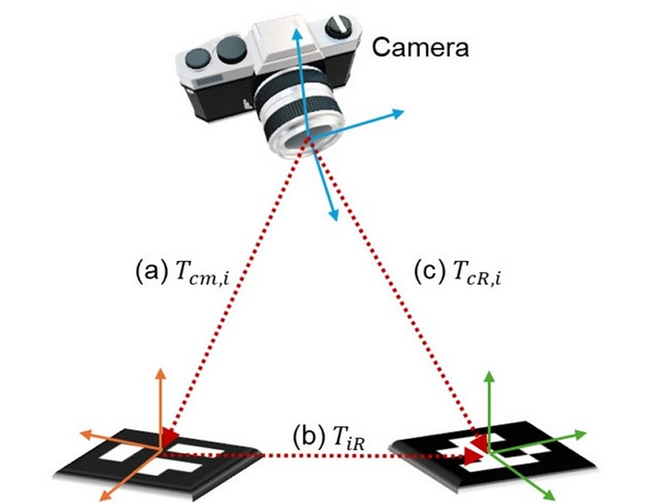

# 3D Position Estimation Using ArUco Markers

---

  

## Introduction

The aim of this project is to estimate the 2D positions and orientations (poses) of multiple cameras using ArUco markers. Each camera is equipped with four rigidly mounted markers.

- Detecting ArUco markers attached to other cameras or to a fixed reference object
- Publishing the detection results and its own calculated pose to other teams via MQTT
- Subscribe to detections from other cameras, which describe marker positions relative to their own local coordinate systems, via MQTT.
- Although each camera only observes a small part of the environment, a global visualization is constructed by combining local detections with pose data received from other systems.
- A fixed reference cube with four ArUco markers defines the origin and orientation of the global coordinate system which makes the validation less complicated.

### Global Coordinate System (Top View)

- **Z+** points forward  
- **Z−** points backward  
- **X+** points right  
- **X−** points left  

### Reference Cube at the Origin

Contains four fixed ArUco markers with IDs `0`, `1`, `2`, `3`  
- **Marker 0**: rear side, visible from the global X+ direction
- **Marker 1**: left side, visible from global Y+ direction
- **Marker 2**: front side, visible from global X− direction
- **Marker 3**: right side, visible from global Y− direction

### Camera Marker Placement (relative to camera body)

- **Marker N0**: front side (near the lens), faces in the viewing direction of the camera
- **Marker N1**: right side, faces to the right (relative to the camera)
- **Marker N2**: back side, faces opposite to the viewing direction
- **Marker N3**: left side, faces to the left (relative to the camera)
Example: Marker 23 is positioned on the left side of camera 2

### Initialization and Requirements

- At least one camera must detect one of the reference markers (`0`–`3`) to initialize the global coordinate system where our camare has the proirity to define the global origin 
- Other cameras can be localized through transitive connections by detecting markers from already localized cameras, as already described.  

## ArUco Marker Basics

- 6x6 ArUco markers (marker size: 2 cm)
- Each marker encodes a unique ID in a 6x6 bit pattern.
- A solid black border improves edge detection.
- Pose (translation and rotation) is calculated using the marker's corners, known size, and intrinsic camera parameters.

  

### Output of cv2.aruco Marker Detection

When using ArUco markers for pose estimation, `tvecs` and `rvecs` provide the position and orientation of a marker relative to the camera.

- **`tvecs = [tx, ty, tz]` -> position relative to camera**  
  Represents the translation of the marker relative to the camera center
  - `tx`: translation along the camera's X-axis (sideways)  
  - `ty`: translation along the camera's Y-axis (upwards)  
  - `tz`: translation along the camera's Z-axis (forwards)  
  The unit depends on the calibration, typically meters or centimeters.  

- **`rvecs = [rx, ry, rz]` -> orientation relative to camera**  
  Describes the rotation of the marker relative to the camera using axis-angle representation 
  - The direction of the vector indicates the rotation axis.  
  - The magnitude ‖rvec‖ is the rotation angle **in radians**.  
  This can be converted into a 3×3 rotation matrix using the Rodrigues formula.

## Transformation Logic

Each camera can detect markers from other cameras or from the reference cube. From these detections (rotation vector and translation vector), a relative transformation matrix between the camera and the marker can be computed. By incorporating knowledge about the marker's position and orientation on its carrier object (camera or cube), the camera's position and orientation can be derived in the global coordinate system.

To ensure that all cameras in the network can be localized, even in cases where no direct connection to the reference cube exists, the system iteratively attempts to resolve both from solved and from unsolved cameras. This process is repeated up to n times, where n is the number of cameras which can exist in the network. In our case 7 times because of 7 Student teams each with a camera. In each iteration, newly solved cameras are used to localize additional cameras through known marker positions. This allows indirect pose estimation through chained detections and ensures complete resolution of the network in the worst case.

  

For all coordinate transformations, 4×4 homogeneous transformation matrices are used. These matrices define the full spatial relationship between the global origin and each individual camera, including both rotation and translation. To compute the transformation from the global reference to a camera, multiple matrices are combined in sequence—for example, by applying known 90°, 180°, or 270° rotations and intermediate transformations from a camera to a detected marker. This chained matrix multiplication ensures that the final transformation correctly represents the camera’s position and orientation relative to the global coordinate system.

For the Theorie of Transformationmatrices have look at:
https://www.brainvoyager.com/bv/doc/UsersGuide/CoordsAndTransforms/SpatialTransformationMatrices.html

## Visualisation

The camera visualization shows the positions and viewing directions of all cameras in the global coordinate system. Each camera is represented as an arrow in the XZ plane, with the arrowhead indicating the viewing direction. The visualization is based on transformation matrices derived from detected ArUco markers. This allows for quick verification of the spatial arrangement and orientation of all cameras.

  

## Technologies Used

Each team uses an independent setup consisting of an ESP32-CAM (with OV2640 camera) and an ESP32 microcontroller and an independent Python Project, hosted with a normal Laptop. This repository belongs to **Team: Linus Wasner, Lukas Bauer** within the larger multi-team project.

- **Languages**: Python (image processing), C++/Arduino (ESP32)
- **Libraries**:
  - `OpenCV` with `cv2.aruco` for marker detection
  - `paho-mqtt` for MQTT communication
  - `numpy` and `pandas` for data processing  
- **Hardware**:
  - ESP32-CAM and ESP32 

## Contributors

Multiple teams from the university courses **"Optical Sensor Systems"** and **"Real-Time Systems"** are collaborating on this project.  
Spervising professor: Prof. Dr. Tim Poguntke

